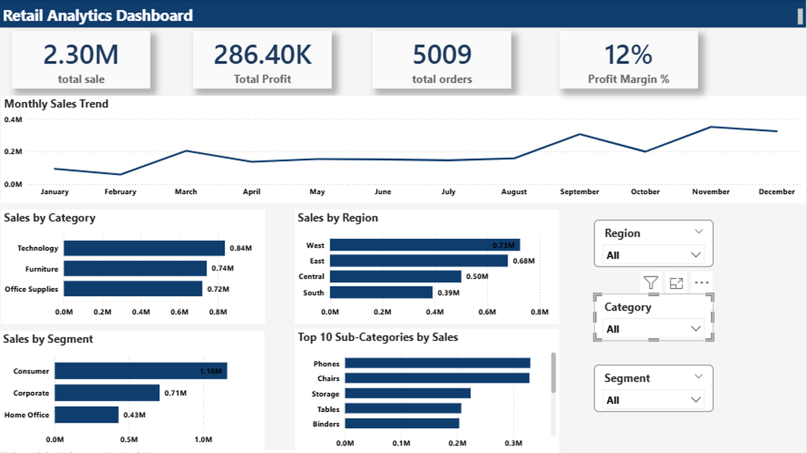

# Superstore Sales Analysis

A retail sales analysis project using Python, SQL, and Power BI to analyze sales, profit, customers, products, regions, and business performance.

## Project Overview

This project analyzes the Sample Superstore dataset to understand sales performance, profitability, customer behavior, product performance, regional performance, and shipping trends.

The project includes data cleaning and analysis using Python, SQL-based business analysis using MySQL, and an interactive dashboard built in Power BI.

## Tools & Technologies

- Python
- Pandas
- Matplotlib
- MySQL
- Power BI
- Microsoft Excel

## Project Workflow

1. Data cleaning and preprocessing using Python
2. Exploratory data analysis using Pandas and Matplotlib
3. Business analysis using SQL
4. KPI and performance analysis
5. Interactive dashboard development using Power BI
6. Business insights and visualization

## Key Analysis

- Overall sales and profit performance
- Category-wise sales and profit
- Sub-category performance
- Monthly sales and profit trends
- Customer sales and profit analysis
- Regional sales and profit performance
- Segment-wise sales and profit
- Top-performing products
- Shipping mode and delivery time analysis

## Dashboard Preview



## Key Results

- Analyzed overall sales and profit performance
- Identified top-performing categories and sub-categories
- Compared sales and profit across regions and customer segments
- Analyzed monthly sales and profit trends
- Identified top customers and products based on sales and profit
- Analyzed shipping modes and delivery performance

## Project Structure

```text
Superstore-Sales-Analysis/
├── Dashboard/
│   └── Retail_Sales_Dashboard.png
├── Data/
│   └── clean_superstore.csv
├── PowerBI/
│   └── Retail_Sales_Dashboard.pbix
├── Python/
│   └── superstore_sales_analysis.py
├── SQL/
│   └── superstore_sales_analysis.sql
└── README.md
```

## How to Run

1. Open the Python file to perform data cleaning and analysis.
2. Run the SQL file in MySQL Workbench for database analysis.
3. Open the Power BI file to explore the interactive dashboard.
